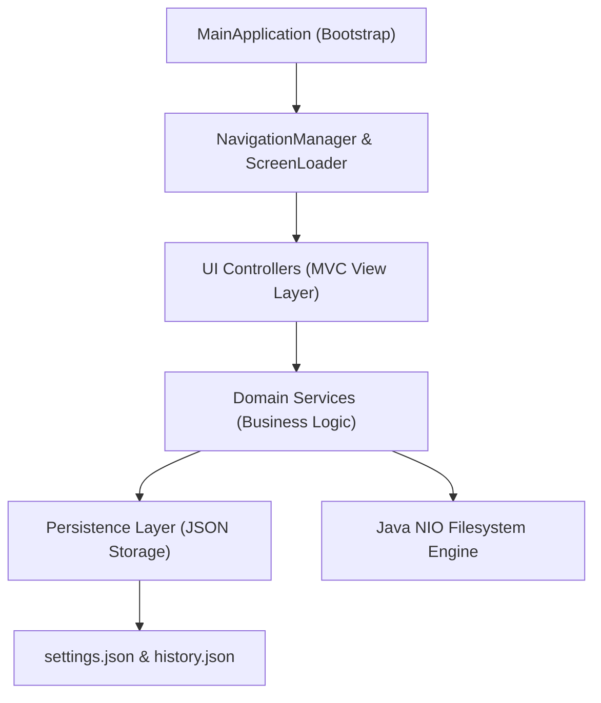

# Smart Folder Organizer

[](https://github.com/your-username/SmartFolderOrganizer/actions/workflows/maven.yml)
[](https://www.oracle.com/java/)
[](https://maven.apache.org/)
[](release/ReleaseNotes-v1.0.0.md)
[](LICENSE)
[]()

**Smart Folder Organizer** is an enterprise-grade desktop application built with Java 21 and JavaFX following Clean Architecture, MVC, and SOLID design principles. It provides high-performance, intelligent file organization, dry-run movement previews, multi-stage cryptographic duplicate detection, transaction audit tracking, LIFO undo restoration, and real-time directory watching.

---

## Key Features

- **Non-Blocking File Scanner**: Fast Java NIO file system scanning supporting recursive tree traversals and category detection.
- **Dry-Run Preview & Collision Analysis**: Preview proposed target category folders (`/Images/`, `/Documents/`, `/PDFs/`, `/Videos/`, `/Audio/`, `/Archives/`, `/Code/`, `/Others/`) with path collision warnings prior to physical file movement.
- **Multi-Stage Duplicate Detection**: Fast file-size pre-filtering combined with streaming multi-threaded cryptographic checksums (`SHA-256`, `SHA-1`, `MD5`) for duplicate identification.
- **Atomic File Operations**: Physical file moves executed safely using Java NIO atomic operations (`Files.move()`) with directory auto-creation and post-move verification.
- **LIFO Undo & Audit History**: Every organization run creates an immutable JSON audit transaction allowing single-click LIFO file restoration to original source directories.
- **Real-Time Folder Watcher**: Automated background directory monitoring utilizing Java NIO `WatchService` with event debouncing and automatic organization pipelines.
- **Reports & Analytics Dashboard**: Dynamic data charts (PieChart, BarChart, LineChart) plotting file category distributions, storage metrics, and organization history over time.
- **Persistent Preferences**: JSON settings storage (`~/.smartfolderorganizer/settings.json`) governing default paths, themes (`Light`, `Dark`, `System`), conflict rules, and thread boundaries.

---

## Technology Stack

- **Core Runtime**: Java 21 LTS (Temurin)
- **UI Framework**: JavaFX 21 (Controls, FXML, Graphics)
- **JSON Serialization**: Jackson Databind 2.17 & JavaTimeModule
- **File I/O Engine**: Java NIO (`java.nio.file`) & Apache Commons IO 2.16
- **Logging**: SLF4J 2.0 API & Logback 1.5
- **Testing & Quality**: JUnit 5, Mockito 5, JaCoCo, SpotBugs, PMD, Checkstyle
- **CI/CD**: GitHub Actions (`.github/workflows/maven.yml`)

---

## Architecture Overview

Smart Folder Organizer enforces strict Model-View-Controller (MVC) separation and Clean Architecture layer isolation:



For detailed architectural specifications, see [docs/Architecture.md](docs/Architecture.md).

---

## Project Structure

```
SmartFolderOrganizer/
├── .github/
│   └── workflows/
│       └── maven.yml          # GitHub Actions CI Workflow Pipeline
├── src/
│   ├── main/
│   │   ├── java/com/smartfolderorganizer/
│   │   │   ├── app/           # Application entry points & bootstrap
│   │   │   ├── controller/    # JavaFX View Controllers (MVC)
│   │   │   ├── model/         # Domain entities (FileItem, Category, Statistics)
│   │   │   ├── service/       # Business engines (Scan, Preview, Org, Duplicate, Undo, Watch)
│   │   │   ├── persistence/   # SettingsService & TransactionPersistenceService
│   │   │   ├── ui/navigation/ # NavigationService, ScreenLoader, NavigationManager
│   │   │   ├── util/          # SizeFormatter, FileUtils, PathUtils
│   │   │   └── validation/    # Configuration & Path Validators
│   │   └── resources/
│   │       ├── css/           # External CSS Stylesheets
│   │       └── fxml/          # FXML Layout Markup files
│   └── test/                  # Automated JUnit 5 Unit & Integration Tests
├── docs/                      # Developer Documentation (Architecture, CI-CD, etc.)
├── release/                   # Production Release Artifacts & Notes
├── pom.xml                    # Maven Configuration & Quality Plugins
└── README.md
```

---

## Getting Started

### Prerequisites

- **Java Development Kit (JDK)**: Java 21 (Temurin) or higher.
- **Apache Maven**: Version 3.8.0 or higher.

### Installation

Clone the repository:
```bash
git clone https://github.com/your-username/SmartFolderOrganizer.git
cd SmartFolderOrganizer
```

### Running the Application

To launch the JavaFX application using Maven:
```bash
mvn clean javafx:run
```

---

## Quality Assurance & Reports

### Running Automated Tests
```bash
mvn clean test
```

### Generating JaCoCo Code Coverage Report
```bash
mvn test jacoco:report
```
The HTML coverage report will be generated at `target/site/jacoco/index.html`.

### Running Static Code Analysis
- **SpotBugs**: `mvn spotbugs:check`
- **PMD**: `mvn pmd:check`
- **Checkstyle**: `mvn checkstyle:check`

---

## Documentation Index

- [Architecture Guide](docs/Architecture.md)
- [CI/CD Pipeline Guide](docs/CI-CD.md)
- [Design Decisions](docs/Design-Decisions.md)
- [Testing Specification](docs/Testing.md)
- [Performance & Scaling](docs/Performance.md)
- [Configuration Reference](docs/Configuration.md)
- [Folder Watcher Engine](docs/FolderWatcher.md)
- [Undo System](docs/Undo-System.md)
- [Duplicate Detection Engine](docs/DuplicateDetection.md)
- [Deployment & Packaging](docs/Deployment.md)

---

## Known Limitations

- **Windows File Handle Locking**: Java NIO `WatchService` retains directory locks on actively monitored parent folders on Windows OS.
- **Cross-Filesystem Atomic Moves**: If source and destination directories reside on different physical disk volumes, atomic move operations automatically fall back to standard copy-and-delete operations.

---

## License

Distributed under the MIT License. See [`LICENSE`](LICENSE) for more information.
