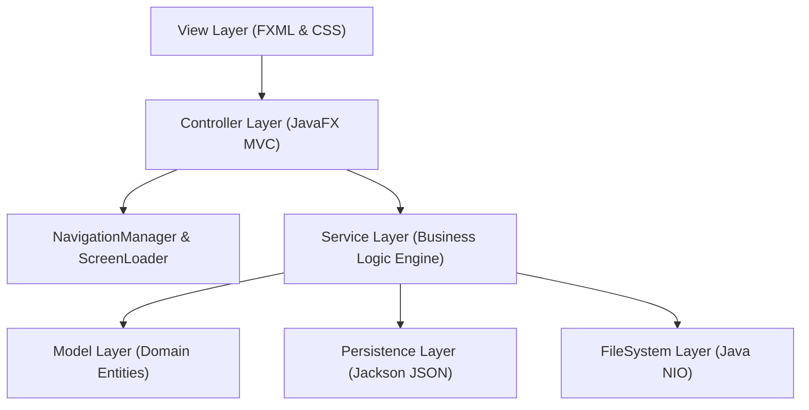
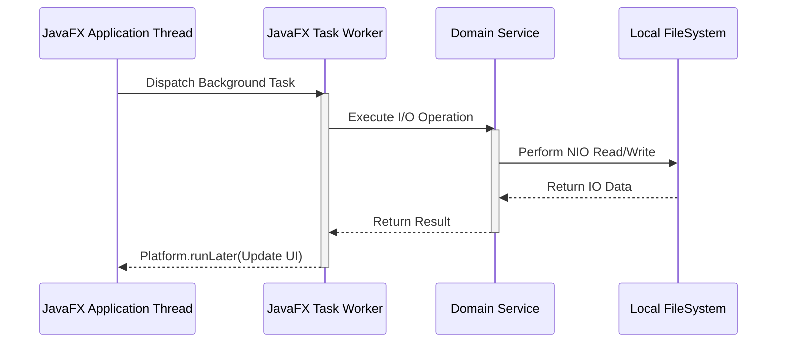

# Architecture Specification

## Overview

Smart Folder Organizer is designed following **Clean Architecture**, **MVC (Model-View-Controller)**, and **SOLID** design principles. The software strictly isolates user interface presentation, domain business rules, filesystem operations, and persistence engines.

---

## Architectural Layers

### 1. View Layer (`src/main/resources/fxml`, `src/main/resources/css`)
- Declarative layout defined using FXML markup files (`MainDashboard.fxml`, `ScannerView.fxml`, `PreviewView.fxml`, etc.).
- Styling isolated in Vanilla CSS stylesheets (`Dashboard.css`, `Scanner.css`, `Preview.css`, etc.) with zero inline FXML style attributes.

### 2. Controller Layer (`com.smartfolderorganizer.controller`)
- JavaFX Controllers coordinate UI controls, data bindings, and background tasks.
- **Strict Constraint**: Controllers contain no direct business logic, file I/O operations, or cryptographic hash processing.

### 3. Service Layer (`com.smartfolderorganizer.service`)
- Enforces single responsibility domain services:
  - `ScanService`: Non-blocking directory tree visitors.
  - `PreviewService`: Target destination path mapping and collision checks.
  - `OrganizationService`: Physical NIO atomic file movement engine.
  - `DuplicateDetectionService`: Multi-stage duplicate detection engine.
  - `UndoService`: LIFO transaction reversal engine.
  - `FolderWatchService` & `FolderWatcherManager`: Real-time NIO `WatchService` directory monitoring.

### 4. Persistence Layer (`com.smartfolderorganizer.persistence`)
- Handles thread-safe JSON serialization/deserialization via Jackson:
  - `SettingsService`: Manages `~/.smartfolderorganizer/settings.json`.
  - `TransactionPersistenceService`: Manages `~/.smartfolderorganizer/history.json`.

---

## Threading Architecture

- **JavaFX Application Thread**: Responsible solely for rendering UI scenes and receiving user input events.
- **Worker Daemon Threads**: All directory scans, SHA-256 hash calculations, file moves, and JSON disk reads execute inside JavaFX `Task<T>` worker threads (`ScanEngine-Worker`, `OrganizationEngine-Worker`, `DuplicateEngine-Worker`, `UndoEngine-Worker`).
