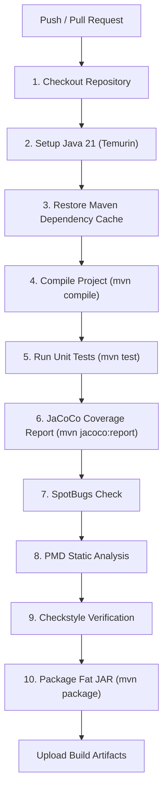

# CI/CD Pipeline Documentation

## Overview

Smart Folder Organizer uses **GitHub Actions** for Continuous Integration (CI) validation. Every `push` and `pull_request` targeting `main`, `master`, or `develop` branches triggers automated build, test, static analysis, coverage, and packaging validation workflows.

---

## Workflow Stages (`.github/workflows/maven.yml`)

---

## Pipeline Artifacts

Each workflow run uploads the following pipeline artifacts:
1. **`jacoco-coverage-report`**: HTML code coverage reports (`target/site/jacoco/`).
2. **`surefire-test-reports`**: Test results and XML summaries (`target/surefire-reports/`).
3. **`SmartFolderOrganizer-Executable-JAR`**: Standalone executable Fat JAR (`target/SmartFolderOrganizer-1.0.0-SNAPSHOT.jar`).

---

## Branching & Release Strategy

- **`main`**: Production-ready code. All PRs require green CI status.
- **`develop`**: Active development branch. Tested continuously via CI.
- **Feature Branches** (`feature/*`): Created for isolated enhancements. Tested via PR triggers to `develop`.

---

## Rerunning Failed Pipeline Builds

1. Navigate to the **Actions** tab in the GitHub repository.
2. Select the failed workflow run.
3. Click **Re-run all jobs** in the top right corner.
