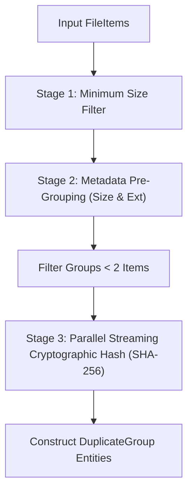

# Duplicate Detection Engine

## Overview

`DuplicateDetectionService` identifies duplicate files using a multi-stage filtering pipeline.

---

## Detection Pipeline

---

## Supported Hash Algorithms
- `SHA-256` (Default, recommended)
- `SHA-1`
- `MD5`
