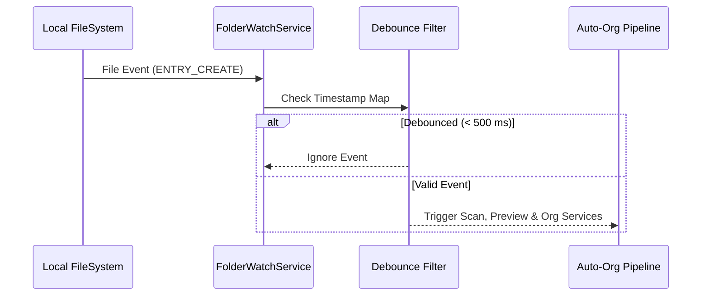

# Folder Watcher Engine

## Overview

The `FolderWatchService` provides real-time directory monitoring using Java NIO `WatchService`.

---

## Workflow

---

## Event Debouncing
- Operating system file creation events often emit multiple rapid notifications (`ENTRY_CREATE` followed by consecutive `ENTRY_MODIFY` writes).
- `FolderWatchService` maintains a `ConcurrentHashMap` of event timestamps. Events occurring within the configured debounce window (`500 ms`) are suppressed to prevent duplicate pipeline runs.

---

## Dynamic Subdirectory Registration
When recursive watching is enabled, creating a new folder inside a monitored directory dynamically registers a new `WatchKey` without restarting the watcher thread.
