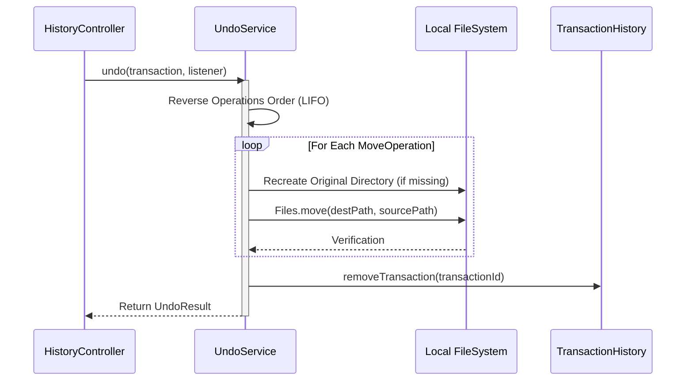

# LIFO Undo Engine Specification

## Overview

`UndoService` reverses completed organization transactions, returning files back to their original source directories.

---

## Undo Execution Sequence

---

## Fault Tolerance & Continuation
If an organized file was manually deleted or locked post-organization, `UndoService` logs the failure in `UndoResult.getErrors()`, triggers `listener.onFileSkipped()`, and continues restoring all remaining valid files in the transaction.
